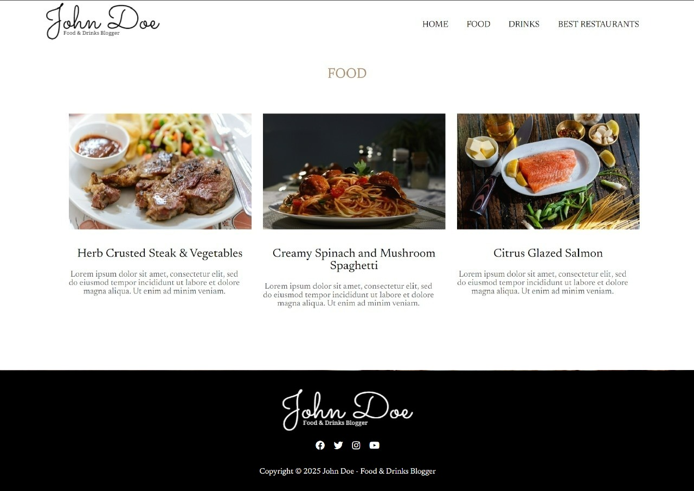

## Overview

A  food blog built using React.js with Vite for fast development, and CSS modules for fast performance, modular design, and maintainable code.

---

## Screenshots

### Home Page  

### Food Page  

### Drinks Page  

### Best Restaurants Page  

---

## Technologies Used

- **React.js** — For building the component-based user interface.
- **Vite** — For lightning-fast development and optimized production builds.
- **CSS Modules** — For scoped, maintainable styling across pages and components.
- **React Router** — For seamless client-side routing.